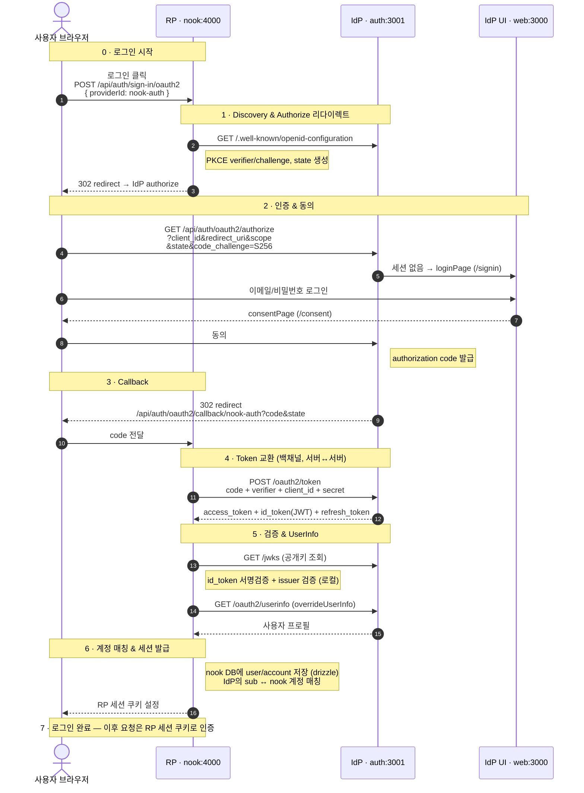

# OIDC 로그인 아키텍처 — Authorization Code + PKCE

nook(RP)이 자체 IdP(Better Auth 기반)에 위임해 사용자를 인증하는 전체 흐름입니다.

## 참여자

| 약어            | 역할                        | 주소        |
| --------------- | --------------------------- | ----------- |
| 사용자 브라우저 | End User                    | —           |
| **RP**          | Relying Party (nook 백엔드) | `nook:4000` |
| **IdP**         | OpenID Provider (인증 서버) | `auth:3001` |
| **IdP UI**      | 로그인/동의 화면            | `web:3000`  |

## 전체 흐름

## 단계별 설명

| #   | 단계                       | 내용                                                                                                                                                    |
| --- | -------------------------- | ------------------------------------------------------------------------------------------------------------------------------------------------------- |
| 0   | **로그인 시작**            | 브라우저가 RP에 `POST /api/auth/sign-in/oauth2 { providerId: nook-auth }` 요청 _(현재 미구현)_                                                          |
| 1   | **Discovery & 리다이렉트** | RP가 IdP의 `.well-known/openid-configuration`을 조회하고 PKCE `verifier`/`challenge`와 `state`를 생성한 뒤, 브라우저를 IdP authorize로 302 리다이렉트   |
| 2   | **인증 & 동의**            | 브라우저가 `code_challenge=S256`을 들고 authorize 호출 → 세션이 없으면 `/signin`으로 로그인, 이어서 `/consent`에서 동의 → IdP가 authorization code 발급 |
| 3   | **Callback**               | IdP가 `/api/auth/oauth2/callback/nook-auth?code&state`로 302 리다이렉트 → 브라우저가 code를 RP에 전달                                                   |
| 4   | **Token 교환**             | RP가 백채널(서버↔서버)로 `POST /oauth2/token`에 `code + verifier + client_id + secret` 전송 → `access_token` + `id_token(JWT)` + `refresh_token` 수신   |
| 5   | **검증 & UserInfo**        | RP가 JWKS 공개키로 `id_token` 서명·issuer를 로컬 검증하고, `/oauth2/userinfo`(`overrideUserInfo`)로 프로필 조회                                         |
| 6   | **계정 매칭 & 세션**       | RP가 drizzle로 nook DB에 user/account 저장, IdP의 `sub` ↔ nook 계정 매칭 후 RP 세션 쿠키 설정                                                           |
| 7   | **로그인 완료**            | 이후 요청은 RP 세션 쿠키로 인증                                                                                                                         |

## 보안 포인트

- **PKCE (`code_challenge=S256`)** — code 가로채기 공격 방어. `verifier`는 RP만 보관하다 4단계 token 교환 시 함께 전송.
- **`state`** — CSRF 방어. authorize 요청 시 생성한 값을 callback에서 대조.
- **백채널 token 교환** — `client_secret`은 브라우저에 노출되지 않고 서버↔서버로만 전달.
- **`id_token` 서명·issuer 검증** — IdP의 JWKS 공개키로 위·변조 및 발급자 확인.
